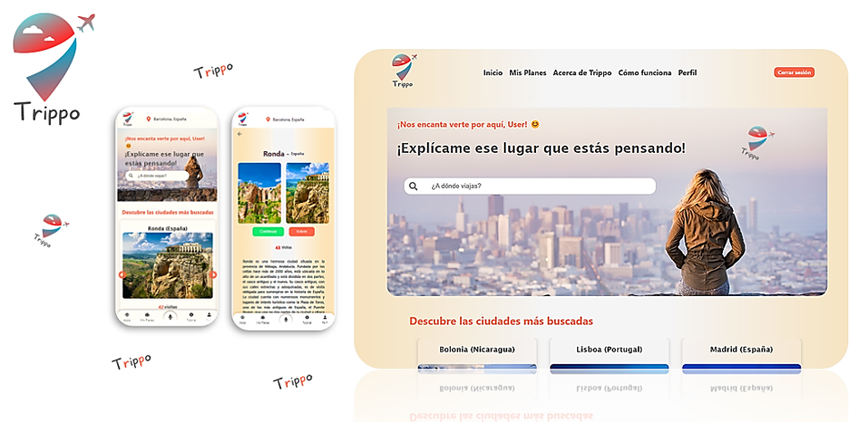
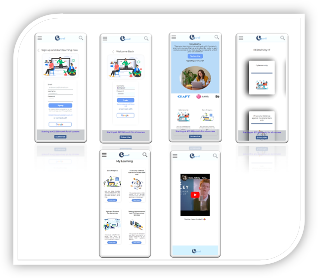
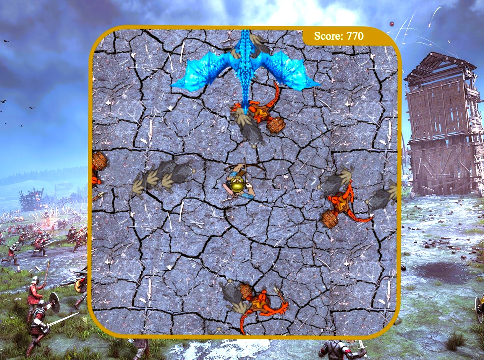

# Monica Camargo, Full-Stack Developer 👩‍💻

**Hey there!** 👋

**I'm Monica Camargo, a Full-Stack Developer** *who's all about building web apps that users love.*
*I graduated from Ironhack school in 2023, and I'm currently sharpening my skills at Imaginning Consultoría.* 
*I'm always up for a challenge and constantly learning new tech stuff.*

**Here's a glimpse of my technical expertise:**

* **Languages & tools:**
    

        
        
        
        
        
        
        
        
        
        
        
        
        
        
    

* **Agile methodologies:**
    * Scrum

## PROJECTS 💻👩‍💻🚀👨‍💻🤖💡

 ### [TRIPPO](https://trippo.netlify.app/) ✈️ Module 3 (Activity planner for a trip) 

  An activity planning application that utilizes OpenAI and Bing to create personalized activity plans for users.

  

* Slideshow presentation: [Link to slideshow presentation](https://onedrive.live.com/edit?id=CBC38F1FF54CB749!884&resid=CBC38F1FF54CB749!884&ithint=file%2cpptx&authkey=!AERv76-BhDQRi48&wdo=2&cid=cbc38f1ff54cb749)
* Frontend repository: [Link to frontend repository](https://github.com/MoniCamargo37/TRIPPO_frontend)
* Backend repository: [Link to backend repository](https://github.com/MoniCamargo37/TRIPPO_backend)
* Deployed application: [Link to deployed application](https://trippo.netlify.app/)

### [COURSE4U](https://course4uu.fly.dev/courses) 📚 MODULE 2 (Online Learning platform)

A comprehensive learning platform with features for users and administrators. This web app is responsive with functions such as browsing, searching, subscribing, and reviewing courses.

https://user-images.githubusercontent.com/116817220/234450405-f42d01f9-fec3-4211-b056-7031fc5a34b7.mp4

!

 * See it in action: [Link to the deployed version](https://course4uu.fly.dev/courses)
 * Slideshow presentation: [Link to slideshow presentation](https://onedrive.live.com/edit?id=CBC38F1FF54CB749!867&resid=CBC38F1FF54CB749!867&ithint=file%2cpptx&authkey=!AJZx3r-j4ND4kqs&wdo=2&cid=cbc38f1ff54cb749)
 * Shared Github repository: [Link to shared Github repository](https://github.com/Module-2-Project-COURSE4U/COURSE4U)
 * Github repository: [Link to Github repository](https://github.com/MoniCamargo37/PROYECT_2_COURSE4U)
 * Trello kanban: [Link to Trello kanban](https://github.com/orgs/Module-2-Project-COURSE4U/projects/1/views/1?layout=board)

### [SODIA GAME](https://github.com/MoniCamargo37/SODIA_Shooter-Game) 🔫 MODULE 1 (Shooter Game)

In a time of blood and fire, the kingdom of Sodia is about to be overrun by the worst kind of enemies.
Are you ready to save the kingdom?

* See it in action: [Link to the deployed version](https://monicamargo37.github.io/SODIA_Shooter-Game/)
* Slideshow presentation: [Link to slideshow presentation](https://docs.google.com/presentation/d/17o8pfU952duM68wNuS3tq6jQ3p9ZCGPL/edit#slide=id.p1)
* Github repository: [Link to Github repository](https://github.com/MoniCamargo37/SODIA_Shooter-Game?tab=readme-ov-file)
  

